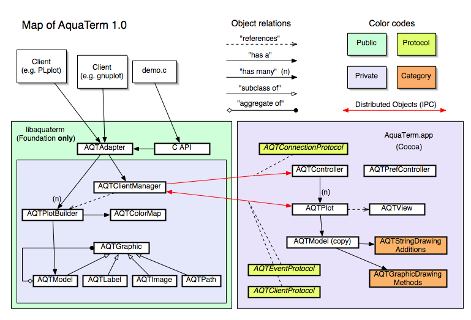

Developer documentation
=====

This document provides some basic information on the internals of AquaTerm and AquaTerm.framework[1] and some info on how to add to or change them. 

Refer to Figure 1 for a schematic view of relations.



**1, AquaTerm.framework**
====

On the client side, all functionality is provided by AquaTerm.framework. One very important aspect of AquaTerm.framework is that it does not rely on AppKit classes, only Foundation classes. The only publicly available class is `AQTAdapter` and an additional C API that wraps the methods in `AQTAdapter`. 

**AQTAdapter**
===

`AQTAdapter` provides an interface to the functionality of AquaTerm. As such, it bridges the gap between the client's procedural calls, requesting operations such as drawing a line or placing a label, and the object-oriented graph being built.

An instance of AQTAdapter is the _only_ object used to interact with AquaTerm. The exception to the rule is the C API described in aquaterm.h. The two are mutually exclusive for client use.

The class `AQTAdapter` is (despite its name) a "facade", hiding the internals from the calling code and relies on `AQTClientController` and `AQTPlotBuilder` to perform all work. The actual assembling of the graph is performed by an instance of class `AQTPlotBuilder` and `AQTClientController` handles all control operations such as keeping track of which instance of `AQTPlotBuilder` is associated with the current plot and establish and maintain communication with the viewer (AquaTerm.app) without any work on behalf of the client.

`AQTAdapter` also provides some utility functionality such an indexed colormap (which is not part of the graph created).

**AQTClientController &lt;AQTEventProtocol&gt;**
===

This is the main controller class present in AquaTerm.framework, a shared instance is used (and instantiated) by `AQTAdapter`. 

When the client opens a new plot, the request is forwarded from `AQTAdapter` to `AQTClientController` which sends a message to AquaTerm (after launching it if it is not running) requesting a new plot. AquaTerm instantiates an object of class `AQTPlot` and replies with a reference to the newly instantiated `AQTPlot` object. `AQTClientController` then instantiates a corresponding `AQTPlotBuilder` and returns a reference to AQTAdapter which will forward all drawing related messages to it. Thus, there is a one-to-one relationship between `AQTPlotBuilder` (in AquaTerm.framework) and `AQTPlot` (in AquaTerm).

It also implements the methods in protocol `AQTEventProtocol` in order to receive event from a plot window, see `AQTEventProtocol`.

**AQTPlotBuilder**
===

This is the class that performs all assembling of plots in the form of an `AQTModel`. `AQTAdapter` has a reference to the currently selected builder and forwards all drawing related messages to it. 

**AQTGraphic**
===

This is the base class of all objects comprising a plot. All objects inherit bounds and color from AQTGraphic as well as an untyped instance variable named _cache used by the category AQTGraphicDrawingMethods. (NOTE: clip rect and transform too in the future. )

**AQTModel : AQTGraphic**
===

This is a container class that keeps a list of all objects in a plot. It also keeps the canvas size of the model and the background color.

**AQTLabel : AQTGraphic**
===

This is a class representing a piece of text and associated information such as position on canvas, base font etc. The text may be either an NSString or an NSAttributedString, with the former providing faster rendering speed and the latter complex styling including  nested sub- and superscripts, per character font changes etc.

**AQTImage : AQTGraphic**
===

This class holds a bitmapped image together with layout information, including a transformation matrix and clipping rect.

**AQTPath : AQTGraphic**
===

This class represents a path, possibly made up of a large number of segments and a fill option.

**2, AquaTerm**
====

AquaTerm is pretty much a standard Cocoa application, in fact, in the future I'd like to make it a NSDocument based application with `AQTPlot` a subclass of NSDocument. AquaTerm is linked with AquaTerm.framework which provides the basic model classes.

Almost all action is performed by the methods in category `AQTGraphicDrawingMethods` which extends the model objects with drawing capabilities. 

**AQTController &lt; AQTConnectionProtocol &gt;**
===

This is the main controller class in AquaTerm. It is responsible for creating plot object on request by the client controller (by implementing the methods in `AQTConnectionProtocol`) and manages the open plots.

**AQTPlot &lt;AQTClientProtocol&gt;**
===

Keeps and manages a model and and a view. Also sends event from the view back to the `AQTClientController` via `AQTClientProtocol` methods.

Models are transfered from the client to AQTPlot when the following messages are sent to AQTAdapter: -renderPlot, -closePlot, and -eraseRect: where the first two also causes a view update. After the (partial) plot has been transfered, the model objects are removed from AQTPlotBuilder in order to avoid sending any object twice since there is a small overhead to each transfer. An empty model (e.g. one which has no objects) will not be transfered. This has the consequence  that subsequent -renderPlot messages will _not_ cause a view update (redraw) unless some new graph object has been added.

Note that if the client and the server side both runs in the same process space (see e.g. -showAvailableFonts: in AQTController) there is no transferring of models whatsoever, AQTPlot then has a direct reference to the original model.

 

**AQTView : NSView**
===

A pretty ordinary subclass of NSView, where the -drawRect: calls upon the graph objects to render themselves by sending a -renderInRect: message to the top object in the graph (always an AQTModel object).

**Categories**
====

**AQTGraphicDrawingMethods**
===

For each subclass of AQTGraphic there are two methods implemented here: `-updateBounds` and `-renderInRect:` which should be pretty self explanatory.

Currently all subclasses of AQTGraphic places an AppKit object (NSBezierPath, NSImage) in _cache and rely on that object to do the actual drawing.

When the graph is built by libaquaterm, the actual bounds are not always possible to compute and in that case -updateBounds must recompute them before drawing (caching).

**AQTStringDrawingAdditions**
===

These are categories that adds the method `-aqtBezierPathInFont:` to `NSString` and `NSAttributedString`. It returns an `NSBezierPath` outlining the string. In the case of an attributed string is parses a number of special attributes, see file for details.

**Protocols**
===

To be documented.

**Functions**
===

A number of utility functions and macros, mostly related to geometric types are in AQTFunctions.m

**3, Events**
====

To be documented.

**4, Error handling**
====

To be documented.

**5, Examples**
====

**Hello World**
===

Example: aqt_hello.m

````

#import <Foundation/Foundation.h>
#import <AquaTerm/AQTAdapter.h>

   int main(void)
   {
      NSAutoreleasePool *pool = [[NSAutoreleasePool alloc] init];

      AQTAdapter *adapter = [[AQTAdapter alloc] init];
      [adapter openPlotWithIndex:1];
      [adapter setPlotSize:NSMakeSize(600,400)];
      [adapter addLabel:@"HelloAquaTerm!" atPoint:NSMakePoint(300, 200) angle:0.0 align:1];
      [adapter renderPlot];
      [adapter release];
      [pool release];

      return 0;
   }

````

Compile using 

`gcc aqt_hello.m -o aqt_hello -framework AquaTerm -framework Foundation`

or, if you prefer handling the file as a C file

`gcc -ObjC aqt_hello.c -o aqt_hello -lobjc -framework AquaTerm -framework Foundation`

**Adding a new property**
====

Next I'll try to outline the steps necessary to add a new property (e.g. clipRect or transform). 

First the API additions to AQTAdapter must be specified, take care to follow the add/set naming conventions. 

Then the properties need to be defined in AQTGraphic for a general property (preferred) or in a specific subclass, as is currently the case with transforms which applies to images only. _Side note - transforms could be beneficial to most objects, particularly AQTLabels, and should move from AQTImage to AQTGraphic in the future._  Don't forget to add encoding/decoding of the new property to `-encodeWithCoder:` and `-intWithCoder:`, otherwise the property will be lost when transfered to AquaTerm.

Next, support for the new property must be added to `AQTPlotBuilder`.

Finally, add code to `AQTGraphicDrawingAdditions` that makes use of the new property. 

**Adding a new subclass of AQTGraphic**
====

To add a new subclass of AQTGraphic (e.g. AQTBezierPath) define a set of API additions to AQTAdapter, take care to follow the add/set naming conventions. Generally , you need to create a new subclass of AQTGraphic, but the example AQTBezierPath is better subclassed from AQTPath.

Next, add support for the class to AQTPlotBuilder.

Finally, add a category to `AQTGraphicDrawingAdditions` that makes renders the new kind of object. 

The following is an example of how `AQTBezierPath` could look:

 

    @interface AQTBezierPath : AQTPath 
    {
    }
    - (id)initWithStartPoint:(NSPoint)p1 controlPoint1:(NSPoint)c1 controlPoint2:(NSPoint)c2 endPoint:(NSPoint)p2;
    @end

````

@implementation AQTBezierPath

- (id)initWithStartPoint:(NSPoint)p1 controlPoint1:(NSPoint)c1 controlPoint2:(NSPoint)c2 endPoint:(NSPoint)p2
{
    NSPoint points[4];
    points[0]=p1;
    points[1]=c1;
    points[2]=c2;
    points[3]=p2;
    self = [super initWithPoints:points pointCount:4];
    return self;
}

@end

````

To render such an object, a category implementing `-updateBounds` and `-renderInRect:` must be added to AQTGraphicDrawingAdditions.

**Adding a new driver**
===

This is clearly the most demanding task of all, but starting by reading the demo code and the present gnuplot and PGPLOT drivers is the best way to go.

Recently a driver for SuperMongo was added, and [this link](http://sourceforge.net/mailarchive/forum.php?thread_id=5700439&forum_id=3090) to the list archives is IMHO a good example of how to add a driver.

**Notes**
===

[1] Previous releases of AquaTerm have relied on a shared library, libaquaterm.dylib, but from the 1.0.0 final release libaquaterm has been replaced by AquaTerm.framework. For backwards compatibility, symlinks to the framework are installed in /usr/local/lib and /usr/local/include/aquaterm.

**Revision history**
===

2004-12-11, initial revison. Hopefully this information can be extracted automagically from source file comments in the future.

2005-07-25. Changing to reference AquaTerm.framework instead of libaquaterm.
